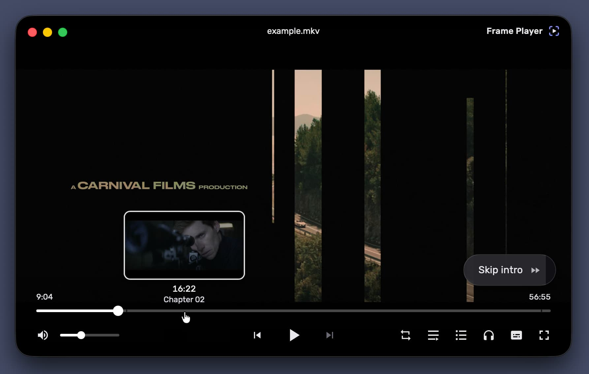

# Frame Player

Local files, links and magnet torrents in one window, on **Tauri 2 + libmpv** —
frame-accurate, instant, and unusually careful about the details.

<p align="center">
  
</p>

<p align="center">
  <sub>Hovering the seekbar previews the frame you would land on; the chapter is
  an opening, so the player offers to skip it.</sub>
</p>

Decoding is libmpv, the same engine as mpv and IINA, so format coverage,
hardware acceleration and HDR are not compromises. mpv renders into a native
child view *behind* a transparent webview and the entire interface is HTML
composited on top, which is what lets it be a real interface rather than
whatever an OSC script can draw.

## Contents

- [Highlights](#highlights)
- [Install](#install) — [Windows](#windows) · [macOS](#macos)
- [Features](#features)
- [Configuration](#configuration)
- [Hotkeys](#hotkeys)
- [Building](#building) — [Windows](#windows-1) · [macOS](#macos-1) · [Tests](#tests)
- [Project structure](#project-structure)
- [Releases](#releases)
- [License](#license)

## Highlights

Most of what follows exists somewhere else. What is unusual is how much of it is
*correct* in the cases where other players are merely plausible.

**Watch a torrent while it is still downloading.** Paste a magnet link and a
whole season becomes a queue you can start playing in seconds. Pieces are
prioritised around the playhead, the seekbar shades what has already arrived so
you can see whether a jump will land or wait, subtitles shipped inside the
torrent are attached automatically, and the next episode is fetched ahead once
the current one is complete. Nothing is downloaded until you actually ask for
it, and **seeding is off by default**.

**Send it to the television, without repacking it first.** The player speaks
both Google Cast and DLNA and picks per device and per file: where the set can
take the release as it is — which for a DLNA renderer usually means a 4K HEVC
HDR MKV with Dolby audio, untouched — that is what it gets, with seeking and
surround intact. Where it cannot, the file is remuxed first, with the video
stream-copied so a film is ready in seconds rather than in an hour. A torrent
that is still downloading can be cast too, fed from the same piece-priority
stream that feeds local playback. While it plays the window is a remote: the
queue moves the session from episode to episode, chapters and skip buttons act
on the television, and disconnecting hands playback back at the position it had.

**Skip the intro.** Chapter navigation, a chapter list, and a skip button for
openings, recaps, "previously on", credits and ads. The button is matched on the
whole chapter title rather than a substring hidden inside it — so "Ending the
war for good" never turns into the closing credits, and the offer stays up long
enough to act on without hanging over the picture for a whole minute.

**Subtitles that are already in sync.** Search OpenSubtitles by the file's own
hash, which identifies the exact release rather than guessing which rip you
have, with a title search as the fallback — and the panel tells you which of the
two produced the list, because they are not the same kind of answer. Downloads
land beside the video and are picked up by themselves next time.

**Previews that show the frame you land on**, not the keyframe before it.
Measured on a 24-minute film, mapping the cursor to a preview the obvious way
put a different scene under it 60% of the time; here the thumbnail sharpens to
the exact frame the moment the cursor stops moving. Seeking is measured too: an
exact seek costs 1.9 s on one file and 0.05 s on another and nothing at all on
most, so the player times the first one and decides from the measurement instead
of trading away precision everywhere to be safe.

**Pick up where you left off, in anything.** Files, links and individual torrent
episodes all resume, behind a start screen of unfinished videos with their own
poster frames. The dub you chose in episode 1 is found again in episode 2 by
language, title and codec — never by track number, which moves between releases.

**A mini player that stays where you put it.** A small always-on-top window that
snaps to the corners and, on macOS, floats over other applications' fullscreen
spaces — the one thing an ordinary always-on-top window cannot do.

The interface is localised **Russian / English**, and every hotkey can be
rebound.

## Install

Both platforms are built and published by CI on every version bump — take the
files from
[the latest release](https://github.com/risenxxx/frame-player/releases/latest):

| Platform | File | Requirements |
|---|---|---|
| Windows | `FramePlayer_<version>_x64-setup.exe` | Windows 10/11, x64 |
| macOS | `FramePlayer_<version>_aarch64.dmg` | Apple Silicon |

**Neither build is signed with a certificate the operating system trusts yet**,
so both stop the first launch with a warning. That is a fact about a
certificate — an Apple Developer ID costs $99 a year and a Windows one more —
rather than about the binaries, which are built in the open from this repository
by [the release workflow](.github/workflows/release.yml). Updates are a separate
mechanism and *are* verified: every package is signed with the project's own key
and the player refuses one whose signature does not match.

Once installed, the player updates itself — it checks for a new version at
startup and every six hours, and the update reopens the current video where it
was.

### Windows

1. Run `FramePlayer_<version>_x64-setup.exe`. SmartScreen shows a blue
   **"Windows protected your PC"** dialog with only a *Don't run* button.
2. Click **More info** — the publisher line appears, and with it a **Run
   anyway** button.
3. Click it; the installer proceeds normally.

SmartScreen is judging the file's *reputation* as much as its signature, and a
new version is a new file, so expect the warning again after an update installed
by hand. Updates applied from inside the player do not go through it.

### macOS

1. Open the disk image and drag **Frame Player** to *Applications*.
2. Launch it once. macOS refuses, saying it cannot verify the app is free of
   malware — dismiss the dialog.
3. Open **System Settings → Privacy & Security** and scroll to the *Security*
   section: the blocked app is listed there with an **Open Anyway** button.
   Click it and confirm with Touch ID or your password.
4. Launch the app again and confirm once more. Every launch after that is
   ordinary.

**Right-click → Open no longer works on macOS 15 (Sequoia) and later** — Apple
removed that shortcut, so System Settings is the only route left. From a
terminal, `xattr -d com.apple.quarantine "/Applications/Frame Player.app"`
does the same thing in one step.

The app bundle carries an *ad-hoc* signature, and that is deliberate rather than
cosmetic: it seals the bundle, which keeps Gatekeeper's refusal on the path that
offers an **Open Anyway** button. Unsealed, the same unsigned app is reported as
damaged, with no button and no way past it except the terminal.

## Features

**Playback**

- **Format coverage on par with VLC** — libmpv/FFmpeg decoding with hardware
  acceleration (D3D11VA on Windows, VideoToolbox on macOS), 10-bit,
  HDR10/HLG/HDR10+ and Dolby Vision profiles 5/8 via `vo=gpu-next`.
- **Frame stepping** `,` / `.` in both directions with no freeze.
- **Seeking that adapts to the file** — an exact seek costs decoding from the
  preceding keyframe, which is free on most files and expensive on a few; the
  mode is probed once per file rather than assumed.
- **Seekbar thumbnails** — hover previews decoded by a dedicated FFmpeg session,
  with a background storyboard pass, a disk cache for reopened files, and an
  exact frame fetched when the cursor comes to rest.
- **Chapters** with a chapter list, and a skip button for openings, recaps,
  previews, credits and ads.
- **A–B loop**, three-state repeat (off / all / one), playback speed.
- **Playback queue** built from the folder of the file you opened, in natural
  order, with the file names taken from container titles where they exist.

**Sources**

- **Links** — anything yt-dlp resolves, plus direct stream URLs.
- **Torrent streaming** — a magnet link becomes a playable queue served from a
  loopback HTTP server, with piece priority following the playhead, buffered
  ranges on the seekbar, embedded subtitles attached and the next episode
  prefetched. Storage is managed from inside the player, and seeding is off by
  default (a compile-time librqbit feature, not a rate limit).
- **Subtitle search** (OpenSubtitles) — matched by file hash, with a title
  search as the fallback, sign-in optional and only to raise the daily limit.

**Television**

- **Two transports, chosen for you** — Google Cast and DLNA, discovered
  together and merged into one row per device. The row says what will happen to
  *this* file on *that* device ("plays as it is", "prepared before it starts"),
  and the choice can be pinned per device.
- **No preparation where none is needed** — a renderer that lists the container
  plays the original file, so HEVC, HDR and surround survive; where a copy is
  required the video is stream-copied and only the audio re-encoded.
- **Torrents while they download** — served to the television from the same
  blocking stream that feeds the player, with a buffered lead before the load.
- **The window becomes a remote** — the queue advances the session, the seekbar
  and keys drive the television, and what a device cannot do (its own volume,
  its own audio-track choice) is said in words rather than left inert.
- **A device check** — one button produces a report of what the device answered:
  reachability, formats it accepts, whether it will seek, what it says about
  volume. Copyable, and it never starts anything on the screen.

**Interface**

- **Frameless UI** — custom title bar, auto-hiding controls over the video,
  custom tooltips, icon OSD; native window chrome and menu bar on macOS.
- **Resume playback** — every file, link and torrent episode reopens where you
  left it, behind a start screen of unfinished videos and poster frames.
- **Remembered tracks** — the audio and subtitle track you chose is scored
  against the next episode's tracks by language, title, codec and forced flag,
  and applied only above a confidence floor, so an episode with no Russian dub
  falls back to mpv's own `alang`/`slang` instead of picking something wrong.
- **Mini player** — a small always-on-top window that floats over other apps'
  fullscreen spaces on macOS, and snaps to screen corners.
- **Zoom and pan** — Ctrl+wheel anchored at the cursor, drag to pan.
- **Frame export** — save or copy the current frame exactly as the VO decoded
  it, HDR tone mapping included, with or without subtitles.
- **Media info panel** — a live readout of codecs, bitrate, colour and channels.
- **Customisable hotkeys** bound to *physical* keys, so they work in any
  keyboard layout.
- **Privacy** — folders can be excluded from the watch history, and excluding
  one also erases what was already recorded for it (positions, remembered
  tracks, thumbnails on disk). History can be turned off entirely.

**Platform**

- File associations, single instance, media keys and taskbar progress on
  Windows; Apple-Event file opening and a native menu bar on macOS.
- **Auto-updates** — signed installers; the player checks a manifest at startup
  and every 6 hours and offers a one-click update that reopens the current video
  at the same position.

## Configuration

The player reads an `mpv.conf` of its own, created with a commented template on
first run:

| Platform | Path |
|---|---|
| Windows | `%APPDATA%\app.frameplayer\mpv.conf` |
| macOS | `~/Library/Application Support/app.frameplayer/mpv.conf` |

The format and options are mpv's own (`option=value`,
[full list](https://mpv.io/manual/stable/#options)); values are applied on top of
the player's defaults at startup. Useful examples from the template:
`target-colorspace-hint=auto` (true HDR output on an HDR display),
`tone-mapping`, `audio-spdif` (bitstream to an AV receiver), `hwdec=no`.

A settings dialog (right-click → *Settings*) covers the common options and writes
to the same file surgically — manual edits, comments and unknown options are
preserved, and changes apply live. The bottom of the dialog links to the file
itself, and reports which decoder is actually in use, so a silent fallback to
software decoding is visible.

## Hotkeys

Bound to physical keys, so they work in any keyboard layout, and all of them can
be reassigned in the settings dialog. macOS defaults differ where the system or
the menu bar owns the combination.

| Key | Action |
|---|---|
| `Space` / `K` | Play / pause |
| `,` / `.` | Frame back / forward |
| `←` / `→` | −5 s / +5 s (`Shift` — ±1 s, exact) |
| `J` / `L` | −10 s / +10 s |
| `Ctrl`+`←` / `→` | Previous / next chapter (`⌃⌘` on macOS) |
| `Home` / `End` | Start / end of file |
| `0`–`9` | Jump to 0–90 % of the file |
| `↑` / `↓` / wheel | Volume ±5 |
| `M` | Mute |
| `[` / `]` | Slower / faster |
| `Shift`+`L` | Repeat mode |
| `A` / `Shift`+`A` | Mark / clear an A–B loop |
| `PgUp` / `PgDn` | Previous / next item in the queue |
| `Z` / `Shift`+`Z` | Subtitle delay ∓ |
| `Ctrl`+`-` / `Ctrl`+`=` | Audio delay ∓ |
| `F` / double click | Fullscreen |
| `P` | Mini player |
| `I` | Media info |
| `O` | Open files |
| `Ctrl`+`L` | Open a link (`⌘L` on macOS) |
| `S` / `Shift`+`S` | Save the frame / with subtitles |
| `Ctrl`+`C` | Copy the frame (`⌘C` on macOS) |
| `Ctrl` + wheel | Zoom, anchored at the cursor |
| `Ctrl`+`0` | Reset zoom |
| Drag on video | Moves the window; pans when zoomed |
| Horizontal wheel | Scrub |

## Building

Requirements: Node.js 20+, Rust (stable), and Windows 10/11 x64 or macOS on
Apple Silicon (release builds are aarch64-only; an Intel build is a second CI
entry away but is not currently produced). Binary SDKs are not committed — they are fetched into `src-tauri/{lib,ffmpeg,tools}`
by the scripts below, and the build paths are wired in
[.cargo/config.toml](.cargo/config.toml).

### Windows

```bash
npm install
npm run fetch-libs   # libmpv (LGPL) + FFmpeg SDK (LGPL, for the sidecar) + libclang (for bindgen)
npm run tauri dev    # development run
npm run tauri build  # NSIS installer
```

### macOS

macOS needs a **patched libmpv**: mpv's macOS backend does not implement `--wid`
at all, so stock libmpv opens a window of its own instead of rendering into
ours. The patch is in [patches/](patches/) (+162/−14 across four files) and is
applied by the build script. Requires Xcode Command Line Tools and Homebrew.

```bash
npm install
scripts/build-libmpv-macos.sh   # patch + build libmpv, fetch the wrapper
scripts/bundle-macos-libs.sh    # flatten the dylib closure into src-tauri/lib, rewrite paths to @rpath
npm run tauri:macos             # development run
npm run tauri:macos:build       # .app bundle
npm run tauri:macos:dmg         # disk image
```

Note that `build-libmpv-macos.sh` links against Homebrew's ffmpeg, which is a
GPL build. A redistributable player needs an LGPL ffmpeg and `-Dgpl=false`,
mirroring the Windows side.

### Tests

The sidecar decode paths have smoke tests. Generate a fixture with the bundled
ffmpeg first (the LGPL build has no GPL encoders, hence `mpeg4` rather than
libx264):

```bash
src-tauri/ffmpeg/bin/ffmpeg.exe -f lavfi -i testsrc2=duration=60:size=1280x720:rate=30 -c:v mpeg4 -q:v 5 test.mp4
cd src-tauri && FP_TEST_VIDEO=/path/to/test.mp4 cargo test --lib -- --nocapture
```

On macOS a test binary cannot find the bundled dylibs on its own, so add
`DYLD_FALLBACK_LIBRARY_PATH=$PWD/lib`.

## Project structure

| Path | What lives there |
|---|---|
| `src/routes/+page.svelte` | The player UI: markup, styles, gestures, hotkeys, menus |
| `src/lib/*.svelte.ts` | State modules — mpv mirrors, watch history, window prefs, thumbnails, zoom, torrents, i18n, the hotkey table |
| `src/routes/veil/+page.svelte` | The black shutter window used to mask fullscreen transitions |
| `src-tauri/src/lib.rs` | Plugin registration, window and app lifecycle, commands |
| `src-tauri/src/thumb_service.rs` | Seekbar thumbnails: decode, background storyboard, disk cache |
| `src-tauri/src/step_engine.rs` | FFmpeg sidecar frame-stepper (kept working, disabled by default) |
| `src-tauri/src/torrent.rs` | Torrent session and the loopback HTTP server mpv opens |
| `src-tauri/src/cast.rs` · `dlna.rs` | Casting: the Cast client, the LAN file server, the UPnP transport |
| `src-tauri/src/opensubtitles.rs` | Subtitle search and download |
| `src-tauri/src/macos_*.rs` | Native window chrome and menu bar on macOS |
| `src-tauri/lua/zoompan.lua` | Atomic zoom+pan applied on mpv's core thread |
| `patches/` | The mpv `--wid` embedding patch for macOS |
| `scripts/` | SDK fetching, the macOS libmpv build, dylib bundling, DMG layout |
| `docs/` | Design notes: why the architecture, the transports and the shipping story look like this |
| `external-issues-backlog/` | Upstream bugs found here, written up for filing |

[CLAUDE.md](CLAUDE.md) is the engineering state of record: how each subsystem
works and which invariants must not be broken. [docs/](docs/) is the reasoning
behind it — the measurements, the alternatives that were tried, and the dead
ends worth not repeating. Code comments and build scripts cite those documents
by name (`architecture.md`, `macos.md`, a numbered `ROADMAP` item).

## Releases

Pushing a version bump in `src-tauri/tauri.conf.json` to `main` triggers CI:
Windows and macOS artifacts are built, signed with the updater key, uploaded
together with `latest.json` to Cloudflare R2 and published as a GitHub Release.
Installed players pick the update up automatically.

Neither platform is code-signed with a real certificate yet — the Windows
installer is unsigned and the macOS bundle carries an ad-hoc signature, so both
show an OS warning on first run; [Install](#install) has the way past each. The
updater signature is a separate thing and is always verified.

## License

The application is [MIT](LICENSE) licensed.

Distributed builds link against **libmpv** and **FFmpeg**, which are used under
the **LGPL v2.1+** — they are dynamically linked and shipped unmodified as
separate libraries, except on macOS, where libmpv carries the embedding patch in
[patches/](patches/) and its source is therefore published here alongside it.
The bundle also includes libass, libplacebo, MoltenVK, LuaJIT and others, each
under its own license. Torrent streaming uses
[librqbit](https://github.com/ikatson/rqbit) (Apache-2.0).

Frame Player is not affiliated with the mpv, FFmpeg or OpenSubtitles projects.
